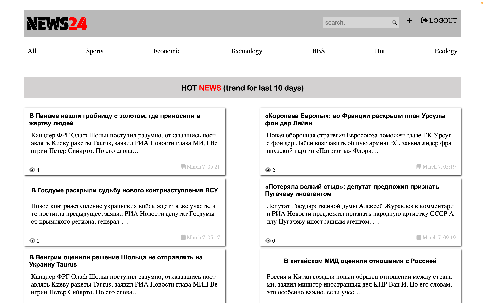

# New Trend Analysis

New Trend Analysis is a Django web application for sharing and analyzing news articles. Users can publish news, view trends over the last 10 days, and engage with a community through comments.




## Table of Contents

- [Features](#features)
- [Getting Started](#getting-started)
  - [Prerequisites](#prerequisites)
  - [Installation](#installation)
- [Usage](#usage)
- [Contributing](#contributing)
- [License](#license)
- [Contact](#contact)

## Features

- Publish and view news articles
- Trend analysis for the last 10 days
- User authentication and commenting system
- User-friendly interface for easy navigation

## Getting Started

### Prerequisites

Before you begin, ensure you have the following installed:

- Python 3.x
- Django
- Other dependencies (specified in `requirements.txt`)

### Installation

Clone the repository and navigate to the project directory:

```bash
git clone https://github.com/yourusername/NewTrendAnalysis.git
cd NewTrendAnalysis
```
